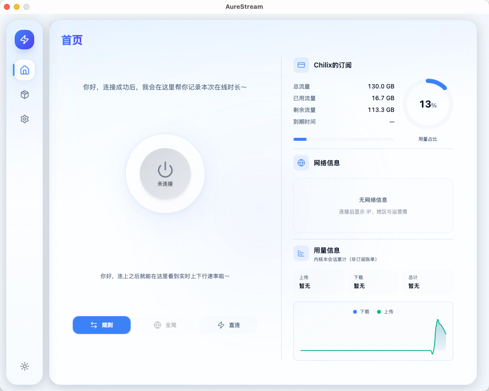
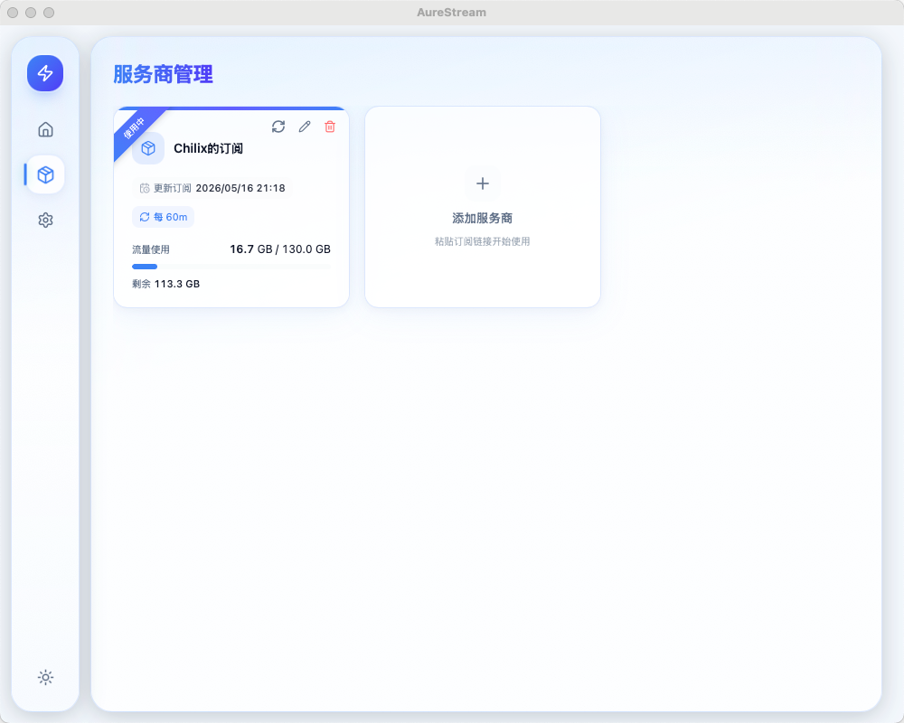
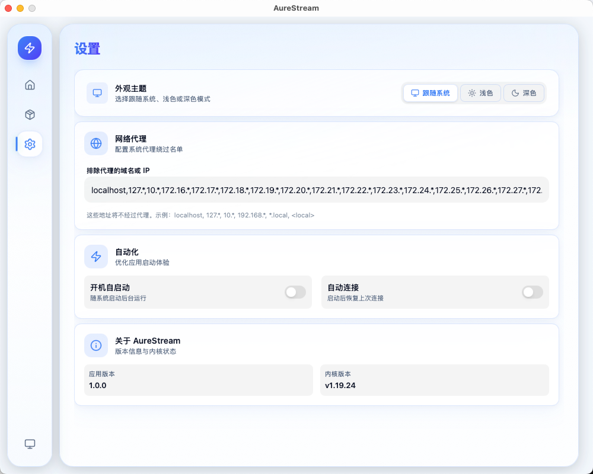

# AureStream


## A Lightweight, High-Performance Proxy Powered by Mihomo

[](LICENSE)
[](https://github.com/BadKid90s/AureStream/stargazers)
[](https://github.com/BadKid90s/AureStream/network/members)
[](https://github.com/BadKid90s/AureStream/issues)

---

## ✨ 简介

AureStream 是一个基于 **Mihomo (原 Clash.Meta)** 核心开发的现代化代理客户端。我们致力于提供一个轻量、高效且功能强大的网络代理解决方案，帮助用户轻松访问全球互联网资源，同时保障网络连接的稳定与安全。

凭借 Mihomo 强大的路由规则和协议支持，AureStream 为您带来无与伦比的网络自由体验。无论您是开发者、研究人员，还是普通用户，AureStream 都能成为您可靠的网络伴侣。

---

## 🚀 主要特性

*   **⚡ 基于 Mihomo 核心:** 继承 Mihomo 强大的性能、丰富的代理协议（如 VMess, Trojan, Shadowsocks, Hysteria2 等）和灵活的路由规则。
*   **🎯 智能分流:** 可自定义复杂的路由规则，实现国内外流量智能分流，提升网络访问效率。
*   **🛡️ 安全稳定:** 提供加密连接，保护您的网络隐私和数据安全。
*   **🌐 跨平台支持:** 基于 Tauri 的桌面客户端，支持 **Windows、macOS、Linux**。
*   **💡 用户友好界面:** 玻璃拟物风仪表盘，浅色 / 深色主题，连接与订阅一目了然。
*   **🛠️ 易于扩展:** 模块化设计，方便二次开发和功能扩展。

---

## 预览









## 主要功能

- **连接与模式**：一键连接，支持规则 / 全局 / 直连等常用模式  
- **订阅与节点**：管理多个服务商与订阅，选择节点、查看延迟、批量测速  
- **状态展示**：集中查看当前节点、速率、订阅余量与网络信息  
- **外观**：浅色 / 深色主题，界面清晰易读  
- **系统托盘**：关闭窗口后驻留后台，从托盘快速打开主界面  

## 下载

若已发布安装包，请在 [**Releases**](https://github.com/BadKid90s/AureStream/releases) 中选择适合你系统的版本下载安装。

具体支持的平台与安装方式以发布说明为准。

## macOS 常见安装问题

### 安装后提示「已损坏，无法打开」

从网络下载的「绿色」或自行安装的应用若出现该提示，**很多情况下是 macOS 的 Gatekeeper（门禁）拦截了未公证应用**，并不一定是文件真的坏了。

**建议优先尝试**（更安全、推荐）：

- **先移除隔离属性（quarantine）**，在「终端」执行（将路径换成你本机 AureStream 的实际位置；默认从 DMG 安装到「应用程序」时一般为下面这一行）：

  ```bash
  xattr -cr "/Applications/AureStream.app"
  ```

  `-cr` 表示递归清除扩展属性，可消除下载带来的 `com.apple.quarantine` 标记。若应用还在 DMG 里未拖入「应用程序」，请先把 `.app` 拖进「应用程序」再执行上述命令，或把引号内路径改为 DMG 里 `.app` 的完整路径。

- 或在「访达」中按住 **Control** 点按应用图标，选择 **打开**，按提示确认。

更完整的说明见 [`docs/MACOS_GATEKEEPER.md`](docs/MACOS_GATEKEEPER.md)。

**若上述方法仍无效**（会**暂时降低**系统对未识别应用的拦截强度，请谨慎使用）：

可通过 **`spctl` 临时调整**系统评估策略，再尝试运行应用：

1. 打开「终端」。
2. 输入 `sudo spctl --master-disable` 后回车，按提示输入登录密码（将 Gatekeeper **全局**评估放宽）。
3. **在此状态下**打开 AureStream（或从 `.dmg` 拖入「应用程序」后再打开），确认是否可以正常运行。
4. 确认能正常使用后，尽快输入 `sudo spctl --master-enable` 后回车，**恢复**默认安全策略。

**请注意**：若在步骤 2 之后**立刻**执行步骤 4 再打开应用，Gatekeeper 往往已经恢复为开启状态，未签名/未公证的应用仍可能被拦截。因此请务必在步骤 2 与步骤 4 **之间**完成首次打开验证。

全局关闭门禁会降低系统防护，仅建议在理解风险的前提下**短暂**用于排障，完成后务必执行 `master-enable` 恢复。若所有方式均无效，可能是安装包异常，请重新从 [Releases](https://github.com/BadKid90s/AureStream/releases) 下载或向开发者反馈。

## 参与贡献

欢迎通过 [Issue](https://github.com/BadKid90s/AureStream/issues) 反馈问题或提出建议；也欢迎提交 Pull Request。更详细的说明与内部文档见仓库内 [`docs/`](docs/README.md) 目录。

## 许可证

本项目以 [MIT 许可证](https://opensource.org/licenses/MIT) 开源。

## 声明

请确保在**遵守当地法律法规**的前提下使用本软件；开发者不对用户的使用行为及其后果承担责任。
