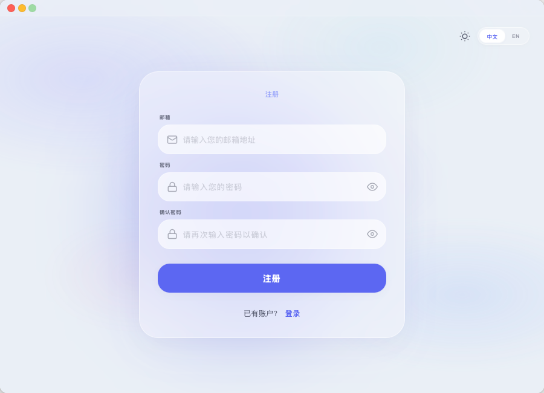
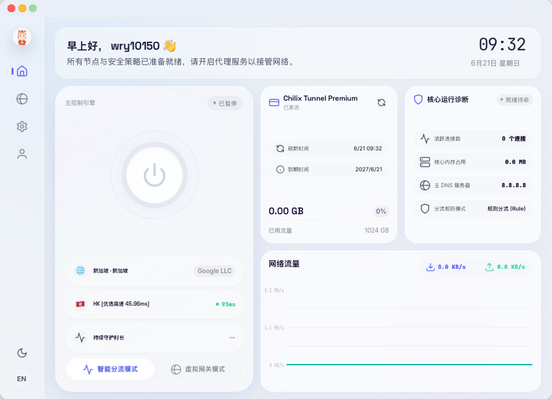
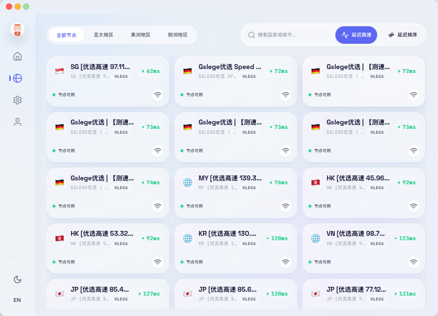
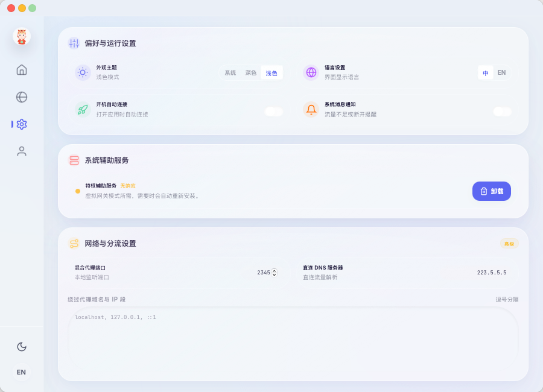
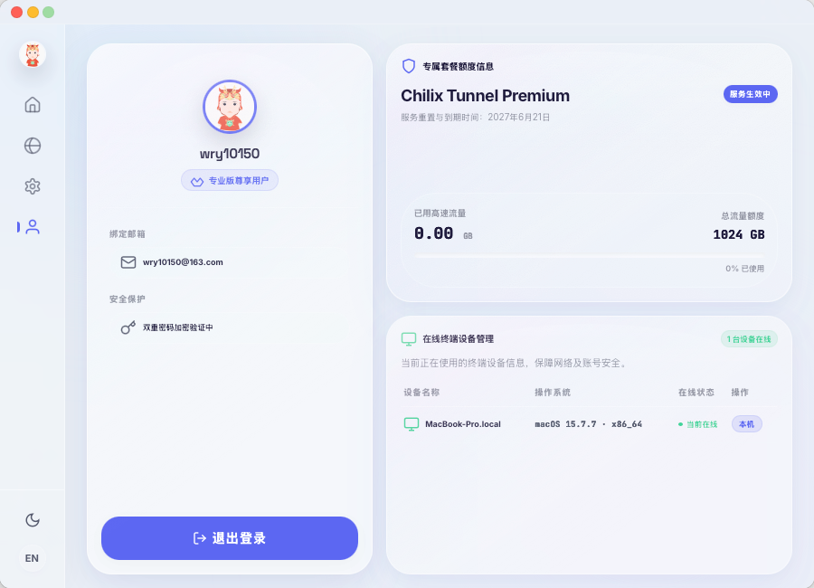

# AureStream

AureStream 是一款现代化、高性能的跨平台代理/VPN 客户端。基于强大的 [sing-box](https://sing-box.sagernet.org/) 核心构建，致力于为您提供轻量、安全、直观的网络代理体验。

## ✨ 核心特性

- 🚀 **强大的代理核心**: 完全基于 sing-box 内核，支持 VLESS, VMess, Trojan, Shadowsocks 等主流协议。
- 💻 **跨平台支持**: 统一的现代化 UI，完美运行于 Windows、macOS 和 Linux。
- 🛡️ **全局 TUN 虚拟网卡**: 原生支持 TUN 模式，轻松接管系统全局流量。
- 🎨 **现代化设计**: 采用最新的前端技术构建，支持明暗主题自动切换，提供流畅的用户交互体验。
- 📊 **实时统计**: 直观的节点延迟测速、实时流量监控与 GeoIP 网络状态显示。
- ⚡ **智能路由**: 内置优化的路由规则与 DNS 防泄漏机制（完美解决 IPv6 网络不可达问题）。
- 📦 **便携与安全**: 不依赖外部网络模板，完全在本地生成安全配置；在 Windows 上支持数据隔离的便携模式。

## 📸 界面预览

  
  

  
  

  
  

## 📖 快速上手

1. **下载安装**: 
   前往 Releases 页面下载对应您操作系统的最新安装包。
2. **导入订阅**: 
   打开应用，进入“订阅”页面，点击添加并粘贴您的服务商订阅链接。支持通过 Deep Link 一键导入。
3. **选择节点并连接**: 
   回到主页，点击左侧的电源按钮即可一键连接！您可以在右侧实时查看网络速度与流量消耗。

## 👨‍💻 开发者与技术文档

如果您是开发者，希望从源码编译、参与贡献，或了解 AureStream 的底层架构设计，请参阅我们详细的 Wiki 文档库：

👉 **[查看 AureStream 完整 Wiki 文档](file:///d:/wry/Projects/AureStream/docs/index.md)**

技术文档包含了系统架构、UI设计系统、构建与部署指南、以及常见故障排查等丰富内容。
