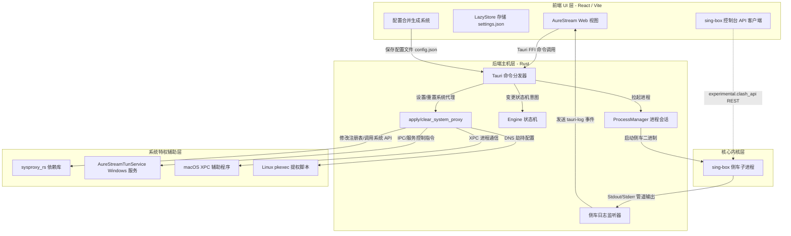

# AureStream 系统设计与架构设计文档

AureStream 是一款基于 **Tauri v2**、**React/TypeScript** 和 **Rust** 构建的优秀跨平台代理及 VPN 客户端。它使用 **sing-box** 作为核心网络路由/VPN 引擎，提供高性能、安全且灵活的网络流量代理服务。

---

## 1. 系统概述

AureStream 采用混合桌面应用架构：

* **前端 UI (React/Vite/TypeScript)**：负责用户界面交互、状态展现、订阅管理、日志查看、节点延迟测试及配置组装。
* **Tauri 主机/后端核心 (Rust)**：作为连接系统底层特权的桥梁。负责配置文件生成、管理 `sing-box` 侧车（Sidecar）进程生命周期、管理连接状态机以及处理系统级网络设置覆盖（如系统代理设置、TAP/TUN 虚拟网卡路由配置）。
* **核心引擎 (sing-box 侧车)**：作为子进程运行（Windows 平台为 `sing-box.exe`，macOS/Linux 平台为对应二进制），解析统一生成的 `config.json` 规则文件，执行底层的网络路由、数据封装以及代理协议握手（如 VLESS, VMess, Trojan, Shadowsocks 等）。

### 技术栈选型矩阵

| 分层 | 技术选型 | 职责 / 备注 |
|---|---|---|
| **前端 UI** | React, Vite, TSX, HSL Styling | 精美的界面、状态路由与交互 |
| **应用外壳** | Tauri v2, 各种插件（Shell, OS, Store, SQL, Process） | 核心 FFI 桥接及系统权限获取 |
| **后端核心** | Rust (Tauri Commands, Tokio 异步运行时) | 状态机控制、进程监控、DNS 异步探测 |
| **系统代理** | `sysproxy_rs` (Windows WinINet API, macOS SystemConfiguration, Linux gsettings) | 动态系统级代理开关与配置修改 |
| **TUN 辅助服务**| `tun-service` (Windows 服务的服务控制管理器 SCM) | 底层 TAP/TUN 虚拟网卡驱动及路由配置管理 |
| **核心内核** | `sing-box` (Tauri 侧车二进制) | 核心 VPN 路由分流与协议处理引擎 |

---

## 2. 总体架构设计

下图展示了 AureStream 的组件拓扑结构与运行时边界：



---

## 3. 核心后端组件设计 (Rust)

### 3.1 进程管理器与状态机 (`src-tauri/src/core/mod.rs`)
`sing-box` 侧车子进程的生命周期管理被封装在全局 `PROCESS_MANAGER` 单例中。
* **ProcessManager 结构体**：
  ```rust
  pub(crate) struct ProcessManager {
      pub(crate) child: Option<CommandChild>,
      pub(crate) mode: Option<Arc<ProxyMode>>,
      pub(crate) config_path: Option<Arc<String>>,
      pub(crate) is_stopping: bool,
  }
  ```
* **状态机设计 (`EngineState`)**：
  采用严谨的转换设计，防止因端口绑定冲突或僵尸进程残留导致的问题：
  * `Idle`（空闲）➔ `Starting`（启动中）➔ `Running`（运行中）
  * `Running`（运行中）➔ `Stopping`（停止中）➔ `Idle`（空闲）
  * `Starting/Running` ➔ `Failed(reason)`（失败）➔ `Idle`（空闲）
* **配置校验**（`src-tauri/src/core/config_check.rs`）：`start` 前执行 `aurestream-core check -c config.json`，失败则进入 `Failed` 并返回 stderr。
* **就绪探测器 (`src-tauri/src/engine/common/readiness.rs`)**：
  在侧车拉起后，异步轮询 `experimental.clash_api.external_controller` 端口（默认 `9191`，与 `settings.json` 中 `singbox_api_port_key` 一致）；探测成功后方才将状态转移至 `Running`。停止时校验 mixed 代理端口（默认 `2345`）是否释放。

### 3.2 平台引擎特定实现 (`src-tauri/src/engine/`)
为了在不同操作系统上管理网络代理和路由行为，AureStream 定义了统一的 `EngineManager` 接口特征（Trait）：
* **Windows (`engine/windows/mod.rs`)**：利用 Tauri Sidecar 机制拉起 `sing-box` 进程，并通过 `sysproxy_rs` 调用 WinINet API 覆写 Windows 系统代理设置。
* **macOS (`engine/macos/`)**：使用 `dns_watcher.rs` 监听 macOS 的 `SCDynamicStore` 网络变化事件，并通过 XPC 架构与特权辅助程序（Privileged Helper）交互实现高级路由配置。
* **Linux (`engine/linux/mod.rs`)**：借由 `pkexec` 执行具有管理员权限的脚本，动态修改 `systemd-resolved` 服务的 DNS 解析配置。

### 3.3 系统代理配置库 `sysproxy_rs` (`src-tauri/sysproxy-rs/`)
一个为项目量身定制的 Rust 跨平台代理开关及配置控制库：
* **Windows**：修改 `Software\Microsoft\Windows\CurrentVersion\Internet Settings` 注册表项，并使用 WinINet 的 `InternetSetOptionW` FFI 函数通知 Windows 系统刷新代理缓存。
* **macOS**：通过 macOS 官方的 `SystemConfiguration` 框架 API 修改网络代理服务配置。
* **Linux**：与 GNOME 桌面环境设置或全局环境变量 (`gsettings`) 进行通信交互。

### 3.4 Windows TUN 驱动服务 `tun-service` (`src-tauri/tun-service/`)
一个专门运行于 Windows 服务控制管理器（SCM）下的后台系统服务，服务名为 `AureStreamTunService`，运行在 `LocalSystem` 特权账户下。当用户开启高性能 **TUN 模式 (IntoProxy)** 时，该服务负责在底层拉起虚拟网卡、配置路由表项目并注入 DHCP DNS 地址。

---

## 4. 核心前端组件设计 (TypeScript)

### 4.1 智能配置合并系统 (`src/config/merger/main.ts`)
该组件将内置规则模板、用户订阅节点以及偏好设置整合成 `sing-box` 能够直接读取的 `config.json` 规则文件。
* **合并流程**：
  1. 读取本地内置的基础配置模板（如端口默认设为 `2345`）。
  2. 从 SQLite 数据库中通过 `getSubscriptionConfig(identifier)` 加载用户选中的订阅节点列表。
  3. 将解析出的代理节点组装并注入到模板的 `outbounds` 节点组中。
  4. 将用户自定义的直连规则（`custom_ruleset_direct`）与代理规则（`custom_ruleset_proxy`）追加合并到 `route.rules` 中。
  5. 重新分配 Sing-Box 内置 DNS 地址，并将持久化缓存文件路径重定向（如 `mixed-cache-rule-v2.db`）。
  6. 注入 `experimental.clash_api`（控制台地址与 secret）与 `cache_file`。
  7. 将组装完成的 JSON 文件写入到 Tauri 专属的应用配置目录。

### 4.2 sing-box 控制台 API（前端 `src/utils/singbox-api/`）

前端通过 sing-box 官方 [experimental.clash_api](https://sing-box.sagernet.org/configuration/experimental/clash-api/) REST 与运行中的核心交互（非独立 Clash/Mihomo 进程）：

| 能力 | HTTP |
|------|------|
| 当前 selector 组 | `GET /proxies/select` |
| 切换节点 | `PUT /proxies/select` |
| 延迟测试 | `GET /proxies/{name}/delay` |
| 实时流量 | `GET /traffic`（NDJSON 流） |

### 4.3 数据存储与持久化
* **Tauri-plugin-store**：
  使用 `settings.json` 键值对存储轻量偏好（如默认端口、分流模式、开机自启、局域网共享等）。
* **SQLite 本地数据库 (Tauri-plugin-sql)**：
  用于关系型数据的可靠本地存储，结构包含：
  * `subscriptions`（订阅信息表）：存储订阅 `id`、`identifier` (唯一UUID)、`name`、`subscription_url`、流量使用信息及过期时间。
  * `subscription_configs`（配置详情表）：以 JSON 字符串形式持久化保存订阅对应的原始节点配置数据。

---

## 5. 核心业务流程图

### 5.1 服务启动流程 (Startup Sequence)

```mermaid
sequence_chart
    participant User as 用户 (GUI)
    participant UI as 前端页面 (React)
    participant Merger as 配置合并模块
    participant Rust as Rust 主程序 (Tauri start)
    participant PM as 进程管理器
    participant Kernel as sing-box 侧车
    participant OS as 操作系统

    用户 -> UI: 点击“开启连接”（系统代理模式）
    UI -> Merger: 调用 setMixedConfig(active_sub)
    Merger -> Merger: 读取模板并合并订阅节点
    Merger -> OS: 写入 config.json 配置文件
    UI -> Rust: 调用 tauri 命令 invoke("start", config_path, "SystemProxy")
    Rust -> Rust: 引擎状态转移为 Starting（启动中）
    Rust -> Kernel: sing-box check 校验 config.json
    Rust -> PM: 进程管理器拉起子进程命令
    PM -> Kernel: 携带 -c 参数运行 sing-box
    Rust -> OS: 驱动系统代理 sysproxy_rs::set_system_proxy(127.0.0.1:2345)
    OS -> OS: 修改注册表，系统网络流量导向 2345 端口
    Rust -> Rust: readiness 探测控制台 API 端口（默认 9191）
    Kernel -> Rust: 控制台端口可连接
    Rust -> Rust: 引擎状态转移为 Running（运行中）
    Rust -> UI: 发送 status-changed 事件通知前端
    UI -> 用户: 界面显示为“已连接”状态
```

### 5.2 服务停止流程 (Shutdown Sequence)

```mermaid
sequence_chart
    participant 用户 as 用户 (GUI)
    participant UI as 前端页面 (React)
    participant Rust as Rust 主程序 (Tauri stop)
    participant PM as 进程管理器
    participant Kernel as sing-box 侧车
    participant OS as 操作系统

    用户 -> UI: 点击“关闭连接”
    UI -> Rust: 调用 tauri 命令 invoke("stop")
    Rust -> Rust: 引擎状态转移为 Stopping（停止中）
    Rust -> OS: 驱动系统代理 sysproxy_rs::clear_system_proxy()
    OS -> OS: 还原注册表，清空系统代理开关（直接连接）
    Rust -> PM: 终止子进程
    PM -> Kernel: 发送 kill 信号
    Kernel -> Kernel: 释放 2345 端口并安全退出
    Rust -> PM: 进程信息置空重置 (reset)
    Rust -> Rust: 引擎状态转移为 Idle（空闲）
    Rust -> UI: 发送 status-changed 事件通知前端
    UI -> 用户: 界面显示为“已断开”状态
```

---

## 6. 安全性设计与机制

* **提权操作安全分离**：路由网卡配置等高权限操作在 Windows 下被隔置在 SCM 后台服务 `AureStreamTunService` 中；macOS 下通过安全的系统 XPC 验证机制；Linux 下通过系统的 `pkexec` 安全认证弹窗，从架构上规避了主程序以高权限运行的越权风险。
* **侧车执行防注入**：所有侧车进程的执行参数、文件名均在 Tauri 编译配置文件 `tauri.conf.json` 中静态定义。用户订阅节点数据仅在内存和 JSON 配置文件中解析，不会作为 Shell 指令执行，有效拦截了命令行注入攻击。
* **UWP 环回代理豁免**：由于 Windows 系统的安全隔离沙盒设计，UWP（应用商店应用）默认无法连接到 127.0.0.1 本地回环代理。AureStream 在 `sysproxy_rs` 二进制程序中内置了 UWP 免代理名单的枚举与持久化写入逻辑，确保 Modern 架构应用也能够通过代理接入网络。
