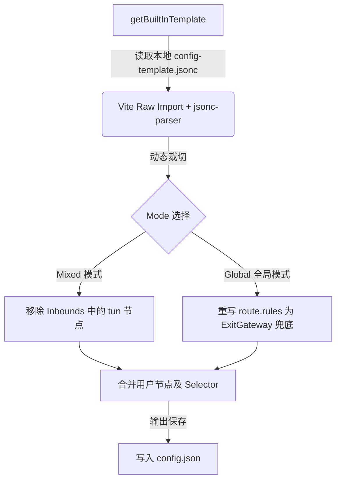

# AureStream 配置合并与模板机制

本文档描述了 AureStream 中基于本地单一 `.jsonc` 的内置配置模板与分流合并机制。

## 1. 核心设计：单一 JSONC 模板
AureStream 摒弃了对外部模板仓库（如 `OneOhCloud/conf-template`）的实时网络拉取，转为完全自主维护的本地配置模板文件：
* **文件路径**：[`src/config/templates/config-template.jsonc`](file:///d:/wry/Projects/AureStream/src/config/templates/config-template.jsonc)
* **模板来源**：基于 `clash2sfa` 高性能路由配置模板进行精简和深度定制。

### 为什么使用单个 JSONC？
1. **防范网络阻断**：不再由于构建/首开时网络同步失败而闪退或使用旧缓存。
2. **纯真注释与高亮**：保留原生 JSONC 注释，便于在开发时进行直观的调整。
3. **零拉取负担**：移除 `prebuild` 和 `predev` 阶段的拉取命令，提升构建效率。

---

## 2. 路由与 DNS 高级容灾优化

### 2.1 双栈智能降级 (Happy Eyeballs)
为解决在“本地网络无原生 IPv6”环境下直连 AAAA 解析而导致国内 CDN (如阿里/腾讯/百度) 无法访问的系统级错误：
1. **解析优先 IPv4**：
   在 `config-template.jsonc` 顶层的 `dns.strategy` 中指定了 `prefer_ipv4`。
2. **直连防穿透**：
   在 `outbounds` 的 `direct` 直连出站中显式指定了 `"domain_strategy": "prefer_ipv4"`。即使系统或浏览器缓存触发了对 IPv6 的网络握手请求，sing-box 仍会以 Happy Eyeballs 双栈算法毫秒级回退到 IPv4 地址进行拨号。

### 2.2 顶级域名路由解析托管
`route.default_domain_resolver` 指向内置的 `system`（即本地本地直连 DNS `223.5.5.5`），域名解析全部由 sing-box 本身接管。

在 `route.rules` 的顶级加入了解析规避机制：
```json
{
    "action": "resolve",
    "strategy": "prefer_ipv4"
}
```
该规则会在流量进入路由匹配的第一时间（域名匹配后、IP匹配前）将域名转换为首选 IPv4 的物理地址。接下来的 `ip_is_private` 和 `geoip-cn` 直连出站便可直接对该 IP 拨号，绕过不可达的 IPv6 网络阻断。

---

## 3. 合并转换流水线 (Merger Pipeline)

配置文件生成在 [`src/config/merger/main.ts`](file:///d:/wry/Projects/AureStream/src/config/merger/main.ts) 中完成：



### 3.1 Mode 转换规则
在 [`src/config/templates/index.ts`](file:///d:/wry/Projects/AureStream/src/config/templates/index.ts) 中，通过逻辑在运行时动态调整基础 `.jsonc` 内容：
* **`mixed` / `mixed-global`**：过滤掉 `inbounds` 中的 `tun` 类型节点，防止启动虚拟网卡。
* **`mixed-global` / `tun-global`**：擦除具体分流路由规则，路由规则列表重写为全局仅使用 `ExitGateway` 出口。
